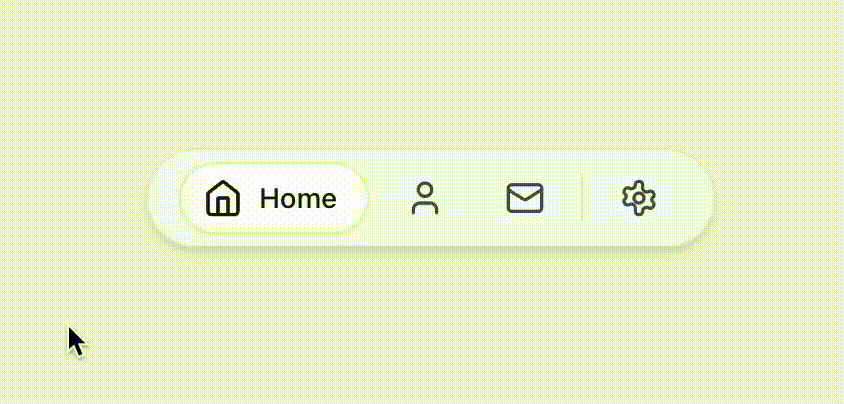

# Expandable Tabs

A beautiful, animated tabs component with smooth morphing transitions. Built with React, TypeScript, Tailwind CSS, and Framer Motion.




## ✨ Features

- 🎨 **Smooth Animations** - Fluid morphing transitions between tab states
- 🌗 **Dark Mode** - Built-in dark mode support
- ⚡ **Lightweight** - Minimal dependencies, optimized performance
- 🎯 **TypeScript** - Full type safety and IntelliSense support
- 🎭 **Customizable** - Easy to customize icons, colors, and separators
- 📱 **Responsive** - Works seamlessly on all screen sizes
- ♿ **Accessible** - Keyboard navigation and ARIA attributes

## 🚀 Quick Start

### Installation

```bash
npm install
```

### Development

```bash
npm run dev
```


## 🎭 Animation Behavior

The component features a unique 4-step animation sequence:

1. **Text Out** - Current tab text collapses
2. **Gather** - All tabs compress together
3. **Un-Gather** - Tabs expand back to normal spacing
4. **Text In** - New tab text expands

This creates a smooth, morphing effect that feels natural and polished.

## 🎨 Customization

### Styling

The component uses Tailwind CSS classes. You can customize the appearance by:

1. Modifying the Tailwind classes in the component files
2. Passing a custom `className` prop
3. Adjusting the constants in `constants.ts`


## 🏗️ Project Structure

```
src/
├── components/
│   └── ExpandedTabs/
│       ├── ExpandedTabs.tsx    # Main component
│       ├── TabButton.tsx       # Individual tab button
│       ├── Separator.tsx       # Separator component
│       ├── types.ts            # TypeScript types
│       ├── constants.ts        # Animation constants
│       ├── animations.ts       # Framer Motion variants
│       └── index.ts            # Public exports
├── examples/
│   └── icons.tsx               # Example icon components
└── App.tsx                     # Demo application
```

## 🔧 Dependencies

- **React** 18+ - UI library
- **Framer Motion** 11+ - Animation library
- **Tailwind CSS** 3+ - Styling
- **clsx** - Conditional class names
- **TypeScript** 5+ - Type safety


## 📝 License

MIT © [Jian.Li]

## 🙏 Acknowledgments

- Inspired by modern UI design patterns
- Built with amazing open-source tools
